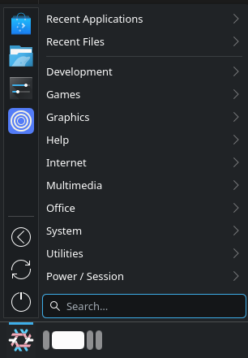
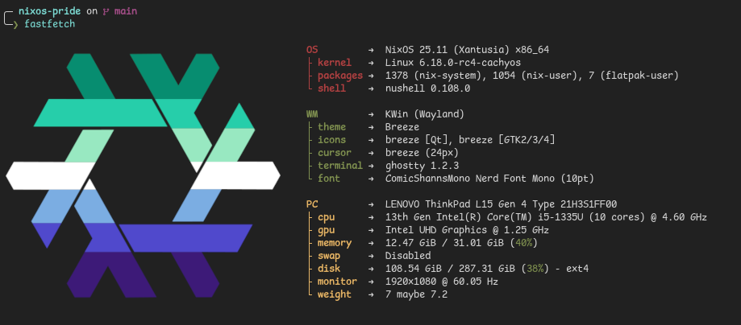

# NixOS Pride icons

### Installing

To install a single image easily, run this:

```sh
curl -fsSL https://not-a-cowfr.github.io/nixos-pride/install.sh | bash
```

### Uses

<details><summary>Custom icon for something like an App Launcher</summary>



</details>

<details><summary>Neofetch/Fastfetch icon</summary>



</details>

### Credits

Original icon is from [NixOS], orginally licensed under CC BY 4.0
All images under [flags](/flags) directory are color-modified versions of the [templates](/templates) which are the unchaged original icons with some extra svg points
